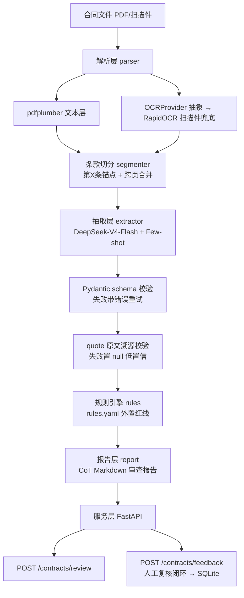

# 采购合同智能审核系统（P4）

上传一份采购合同 PDF（文本型或扫描件）→ 自动解析条款 → LLM 结构化抽取关键字段（含原文引用溯源）→ YAML 规则引擎比对业务红线 → 输出风险分级审查报告（高危/警告/通过）。

## 架构图



## 快速开始

```bash
# 1. 安装依赖（Python 3.11+）
pip install -r requirements.txt

# 2. 配置 LLM（硅基流动 DeepSeek-V4-Flash，OpenAI 兼容端点）
cp .env.example .env   # 填入 LLM_API_KEY

# 3. 生成 30 份仿真合同样本 + 标注集（可选，data/ 已含生成结果）
python scripts/generate_samples.py

# 4. 离线回归测试（不调 LLM）
python tests/test_pipeline.py

# 5. 批量抽取（调 LLM，30 份约 6 分钟）
python scripts/run_extraction.py

# 6. 评估字段级 P/R/F1 + 风险分级准确率
python eval/eval.py

# 7. 启动服务
uvicorn app:app --host 0.0.0.0 --port 8020
# Swagger: http://127.0.0.1:8020/docs
```

### 调用示例

```bash
# 审核一份合同（返回 JSON + Markdown 报告）
curl -X POST http://127.0.0.1:8020/contracts/review \
     -F "file=@data/samples/C02.pdf"

# 人工复核修正（闭环数据沉淀）
curl -X POST http://127.0.0.1:8020/contracts/feedback \
     -H "Content-Type: application/json" \
     -d '{"record_id": 1, "corrections": {"payment_days": {"value": 89, "quote": "..."}}, "comment": "修正说明"}'
```

## 实测指标（30 份仿真合同，12 份埋点违规）

| 指标 | 实测值 |
|---|---|
| 字段级宏平均 F1（9 关键字段） | 1.0000 |
| 字段级微平均 F1 | 1.0000 |
| 风险分级准确率（规则引擎） | 30/30 = 100% |
| 单份端到端耗时 | 文本型 ~8s / 扫描件 ~35s（含 OCR） |
| 离线回归测试 | 25/25 PASS |

## 核心设计决策（为什么这么做）

| 决策 | 理由 |
|---|---|
| 能不 OCR 就不 OCR | 先判断文本层（pdfplumber，均值 ≥50 字符/页），扫描件才走 OCR——OCR 是兜底不是默认，省 80% 文档解析耗时 |
| OCRProvider 抽象 | `parse(path) -> str` 统一接口，RapidOCR / PaddleOCR / 云 OCR 换实现只改一行装配 |
| 逐条款抽取 | 上下文可控、quote 溯源粒度细；长合同先分治再汇总 |
| quote 强制溯源 | 每字段必须附原文引用，归一化比对（空白/全角￥/千分位），失败重试、再失败置 null——抽取幻觉在闸门处拦截 |
| 正则 + LLM 双通道归一化 | 金额大写转换/日期/天数用正则优先，LLM 值兜底——数字大写转换不靠模型自觉 |
| 规则引擎 YAML 外置 | 红线随业务变，改 `rules.yaml` 不改代码；确定性判断归规则，语义理解归模型 |
| 规则分层 severity | 未会签=高危，会签情况未提及=警告——信息缺失不误伤成高危 |

## 踩坑记录

1. **RapidOCR 200dpi 漏检长文本行**：第四条验收条款整行丢失 → 渲染 DPI 提到 300 后找回；OCR 质量与渲染参数强相关。
2. **OCR 改写标点**：`¥620,000.00` 变 `￥620000.00`（全角+千分位丢失）→ quote 校验做归一化比对而非逐字比对。
3. **LLM 偶发输出类型漂移**：amount 直接返回数字而非字符串 → schema 放宽 `str|int|float`，重试机制保留为兜底而非常规路径。

## 目录结构

```
contract-review/
├── app.py                  # FastAPI 入口（/contracts/review /contracts/feedback /healthz）
├── pipeline.py             # 全链路编排：解析→切分→抽取→规则→报告
├── storage.py              # SQLite：review_records / feedback（复核闭环）
├── common/                 # 配置加载 + 日志规范（[时间戳][级别][模块]，10MB 轮转）
├── parser/                 # pdf_parser / ocr（OCRProvider 抽象）/ segmenter
├── extractor/              # schema（Pydantic）/ prompts（few-shot）/ extract（quote 校验+归一化）
├── rules/                  # engine（通用比对器）+ rules.yaml（红线外置）
├── report/                 # CoT Markdown 报告（LLM 生成 + 模板兜底）
├── eval/                   # eval.py（P/R/F1）+ annotations/（30 份 ground truth）
├── scripts/                # generate_samples.py（仿真合同生成）/ run_extraction.py
├── tests/                  # 离线回归测试（25 项，不调 LLM）
├── data/samples/           # 30 份仿真合同（文本型 23 + 扫描件 7）
└── logs/                   # 运行日志
```
